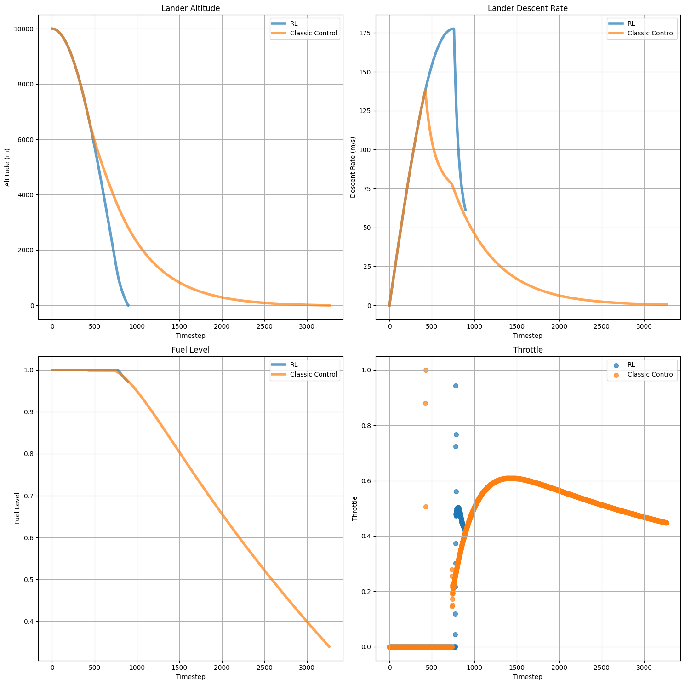
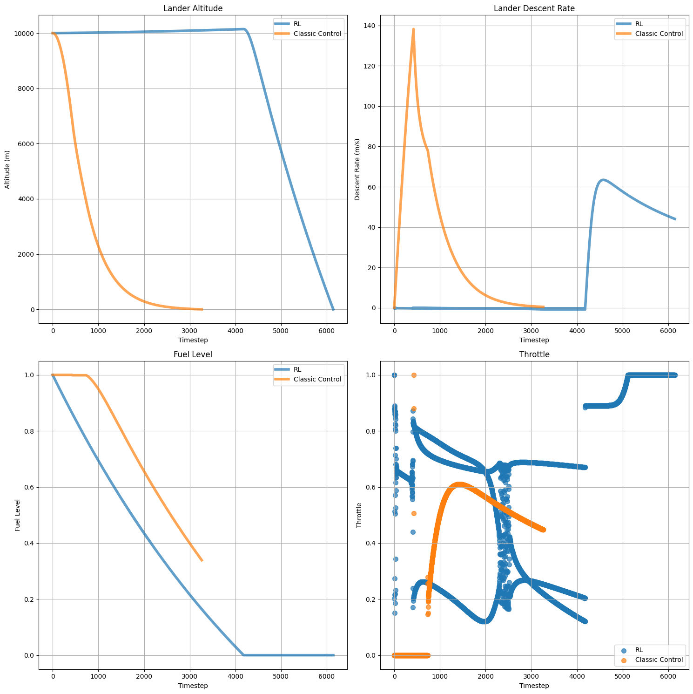
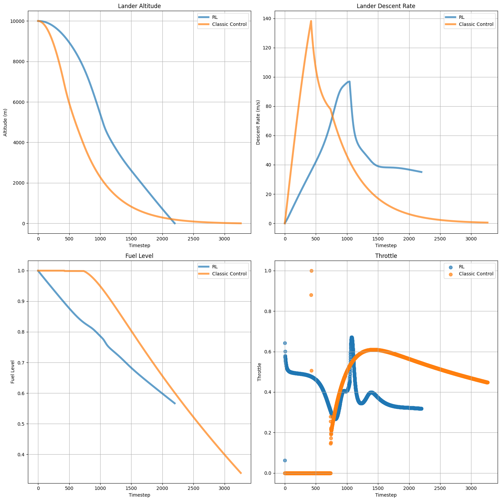
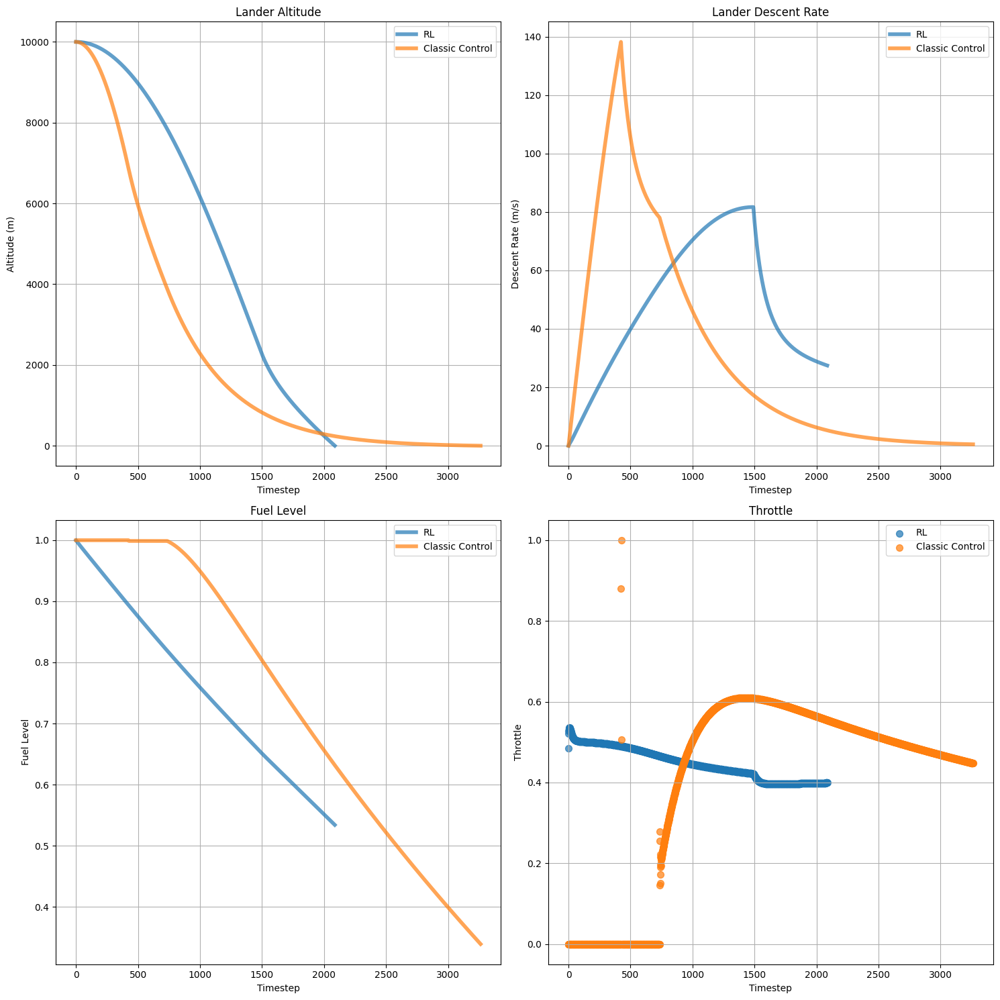

# A PPO Method in Mars Lander
This project uses [Stables Baselines 3](https://stable-baselines3.readthedocs.io/en/master/#) to implement [Proximal Policy Optimization](https://arxiv.org/abs/1707.06347) to simulate spacecraft landing. Our graphics and simulation engine are implemented on `C++`, while model training and inference are in `Python`. 

## Quickstart

Install the relevant files in `requirements.txt`. To quickly view a comparison of PPO against proportional control, navigate to `src/lander_py/train.py` and run this file to train the PPO model. Then run `benchmark_agents` to plot the performance of these 2 methods.

I've abstracted away most of the C++ codebase using `Pybind11` into a module `lander_agent_cpp.so` available in the `build/` folder. This provides the `lander_agent_cpp.so` class, which is the interface where we interact with the `C++` environment.

> Unfortunately, I've not integrated the graphics engine with RL yet. This is because the `C++` codebase uses almost pure global variables and global functions, which makes encapsulation and abstraction incredibly difficult!

If you'd also like to run the graphics engine, set `render=true` and `agent_flag=false` in `main.cpp` to run the interactive graphics engine. Then build the project using the `CMake` file using the instructions below.

## Results

### Sparse Reward Function

```
if landeded safely:
    return 100.0
else if crashed:
    return -100.0
else:
    return -1.0
```


The proportional control algorithim did much better than PPO, unfortunately due to the problem of sparse rewards the agent was unable to successfully get positive signal to decrease its velocity to below 0.5m/s. While during training steps were taken to encourage exploration (like increasing the entropy coefficient, see Equation 9 of the original PPO paper, and decreasing the penalty on each time step), the model was still unable to learn a good enough landing algorithim.

Our observation (state) space consists of the velocity vector $V$, the position vector $R$, fuel left, altitude from Mars' surface $H$, and the climb speed $V*e_r$. (Note that the climb speed is a signed scalar, and the descent rate is the negative of the climb speed). Our action space consists of the throttle value  $\in [0,1]$. 




We only ever obtain rewards at the end of the episode, which makes getting signal to update the weights correctly extremely difficult. Using a simulation timestep $ \delta t$ of $0.1$, one episode takes on average $5000-8000$ timesteps hence $500-800$ seconds to complete. This means the agent has experienced on average thousands of interactions before it ever receives a signal. Hence, we need to do training for much longer in order to learn.

> We introduce a slight negative reward on every step to prevent the agent from being "lazy" and artifically prolonging the simulation

### Kinetic Energy Reward Function

Perhaps the landing problem is too complex, and we can start off with a simpler problem having a more robust reward function providing rewards throughout the episode. I tried setting the kinetic energy as the reward function (we add a negative sign as to minimize it):

```python
kinetic_energy = 0.5 * np.sum(velocity_array**2)
return -kinetic_energy
```

The model successfully learned how to hover, albeit in an extremely stochastic way.



We can see the altitude remaining more or less constant, with zero velocity before the fuel is used up, and throttling no longer works

### Mechanical Energy Reward Function

```python
potential_energy = -(self.GRAVITY_CONSTANT * self.MARS_MASS) / np.linalg.norm(
    position_array
)
kinetic_energy = 0.5 * np.sum(velocity_array**2)
return -(potential_energy + kinetic_energy)
```

Inspired by the success of learning to hover, we try to set the sum of the potential energy and the kinetic energy as the reward function. After all, the minimum energy state is when the model successfully lands - at the surface with zero velocity. Despite nice theoretical properties, this reward function did not work in practice.



### Squared Altitude Reward Function

After playing around with various forms of reward functions, the one that was closest to successfully landing is of this form:

```python
kinetic_energy = 0.5 * np.sum(velocity_array**2)
return -(altitude**2 + 1.5 * kinetic_energy)
```

where the agent did learn to decrease it throttle upon approaching the surface, but not quite good enough to decrease its landing speed to below the required 0.5m/s.



## Repository structure

```
.
├── CMakeLists.txt
├── README.md
├── requirements.txt
├── src
│   ├── assignment2.py
│   ├── lander_cpp
│   │   ├── agent.cpp
│   │   ├── agent_wrapper.cpp
│   │   ├── autopilot.cpp
│   │   ├── lander.cpp
│   │   ├── lander.h
│   │   ├── lander_graphics.cpp
│   │   ├── lander_mechanics.cpp
│   │   └── main.cpp
│   ├── lander_py
│   │   ├── benchmark_agents.py
│   │   ├── lander_env.py
│   │   ├── test_lander_agent_cpp.py
│   │   ├── test_lander_env.py
│   │   └── train.py
|   |   └── models/
│   └── spring
│       ├── assignment1.py
│       ├── assignment3.cpp
│       ├── spring.cpp
│       ├── spring.py
│       └── visualize_cpp.py
└── utils.py
```

`src/lander_cpp/` contains the `OpenGL` graphics method in `lander_graphics` and core numerical simulation methods in `lander_mechanics`. `agent.cpp` contains our `Agent` interface with Python, while `agent_wrapper` uses `Pybind` to wrap around our `Agent` class so that we can call them in Python. `autopilot` contains the C++ proportional controller implementation. `main.cpp` contains the main function to display the graphics engine and run an agent without using the engine.

> As basically all functions and variables are global, it's very difficult to containerize methods and integrate our `Agent` class seamlessly into the graphics engine. Major refactoring is needed to containerize `update_lander_state()`, `autopilot()`, `numerical_dynamics()`, `update_visualization()` by taking in our `Agent` class as a parameter, or accessing variables locally

In `src/lander_py/`, this contains code to train and do evaluate our agents. `test_lander_agent_cpp` tests whether `pybind11` has successfully translated all our methods, while `test_lander_env` tests whether our `gymnasium` environment is working as intended. `models/` do contain the zip files for all our model weights.

`spring/` contains some of the assignment code for simulating simple harmonic motion.

## Compiling the project

We use `Cmake` to compile our lander project (but not for spring). Make sure you have `Cmake`, `Pybind11`,`OpenGL` and `GLUT` installed for the `C++` projects.

1. Ensure `CMakeLists.txt` is in the root directory
2. Create a build directory in the root: `mkdir build && cd build`
3. Run CMake: `cmake ..`
4. Build the project: `make`

> After compiling, you can do `import build.lander_agent_cpp as lander_agent_cpp` to use modules from our C++ `Agent` class, and run C++ modules directly from Python

### Running Files

- After building, we can run `./lander` from `build` folder, to run `main.cpp`
- To use the modules in `lander_agent_cpp.so`, to import from this file like a regular Python files containing classes

### OpenGL on WSL

To set up OpenGL to display correctly on WSL, follow these [instructions](https://gist.github.com/Mluckydwyer/8df7782b1a6a040e5d01305222149f3c) to setup VcXsrv server.
- use VcXsrv to open a new server
- set `export DISPLAY=[Your IP Address]:0` where `0` means your screen number. You should've set this to zero previously.
- change `LIBGL_ALWAYS_INDIRECT=1`


## Refactoring of Global Variables

Previously, the repo used a flag to selectively declare variables. All variables are now declared as `extern` in `lander.h`, and fully declared at the start of the file where they are first used.
- Ideally we would use singleton classes here or encapsulated classes, but there's simply too many variables interacting with each other

- added a `render` variable that allows me to run simulations without `GLUT`
    - currently, only `render=true, agent_flag=false` and `render=false,agent_flag=true` are supported

## Tips and Tricks

- Making model (actor, critic smaller)
- Changing reward function to be mechanical energy
- PPO Params
    - Increasing entropy
    - Batch size
    - num epochs
    - Learning rate
- Discrete Action space instead of continuous?
- Often, training too long can decrease performance (mean reward decreases)
- First make the landing condition easier (lower threshold for landing), then slowly decrease threshold

### Normalization

- Important to normalize observations space, especially when observations have a large range
    - the `gym` package's `NormalizeObservations` wrapper environment is very convenient for this!
    - keeps a running mean of the observation, but note that the way it does this is by wrapping around the `step` function
    - this is why for plotting, you only plot stuff defined in the `step` function for info
        - important things like the un-normalized observations
        - the stuff coming out of `step` should only be what the model sees

- Really crucial to normalize rewards using the `NormalizeReward` wrapper environment which keep the exponential moving average having a fixed variance
    - this is extremely helpful as I don't need to manually set constants to change my reward
    - If you don't normalize rewards and they are too big, somehow decreases with training instead?

- I also "normalized" the actions space by doing a linear transformation from the original action space of $throttle \in [0,1]$ to $[-1,1]$ so that the model can learn better
- So currently, our base `LanderEnv` accepts transformed actions and outputs untransformed observations


